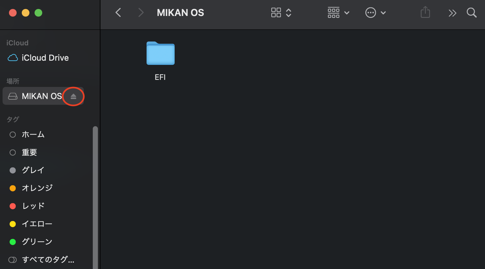

# OS自作もくもく ログ

## Windows WSL2 (Ubuntu)での実行方法

### qemuのインストール

```sh
sudo hwclock -s # WSLは時間がずれることが多いので修正
sudo apt update
sudo apt upgrade
sudo apt install qemu qemu-system qemu-utils
```

`qemu-system-x86_64`のバージョンが4.2.1ならOK。

```sh
$ qemu-system-x86_64 --version
QEMU emulator version 4.2.1 (Debian 1:4.2-3ubuntu6.16)
Copyright (c) 2003-2019 Fabrice Bellard and the QEMU Project developers
```

### リポジトリのクローンと実行

```sh
mkdir github
cd github
git clone https://github.com/uchan-nos/mikanos-build.git osbook
git clone https://github.com/kaityo256/osmokumoku.git
```

`osmokumoku`ディレクトリの中のchap01_wslの`mkimg.sh`と`run.sh`を実行する。

```sh
cd osmokumoku
cd chap01_wsl
source mkimg.sh
source run.sh
```

QEMUが起動し、Hello, world!が表示されるはず。

## Macでの環境構築

### リポジトリのクローン

```sh
mkdir github
cd github
git clone https://github.com/uchan-nos/mikanos-build.git osbook
git clone https://github.com/kaityo256/osmokumoku.git
```

以下、`chap01_mac`で作業。

```sh
cd osmokumoku
cd chap01_mac
```

### qemuとdosfstoolsのインストール

```sh
brew install qemu qemu-system dosfstools
```

### ディスクイメージの作成

```sh
qemu-img create -f raw disk.img 200M
/usr/local/Cellar/dosfstools/4.2/sbin/mkfs.fat -n 'MIKAN OS' -s 2 -f 2 -R 32 -F 32 disk.img       
```

### ディスクへの書き込み

```sh
open disk.img
```

Finderで「MIKAN OS」がマウントされたのを確認してから、

```sh
mkdir -p /Volumes/MIKAN\ OS/EFI/BOOT
cp BOOTX64.EFI /Volumes/MIKAN\ OS/EFI/BOOT
```

その後、Finderの「MIKAN OS」の右側にあるイジェクトボタン(unmount)を押す。



コマンドラインからのunmountでは正しく書き込みがなされないので注意。

### QEMUの起動

```sh
qemu-system-x86_64 -drive if=pflash,file=$HOME/github/osbook/devenv/OVMF_CODE.fd -drive if=pflash,file=$HOME/github/osbook/devenv/OVMF_VARS.fd -hda disk.img
```

### シェルスクリプト

以上の作業をまとめて、

```sh
source mkimg.sh
```

手作業でのunmount。

```sh
source run.sh
```

で行ける。

## [作業ログ](log.md)

## ライセンス

CC-BY
