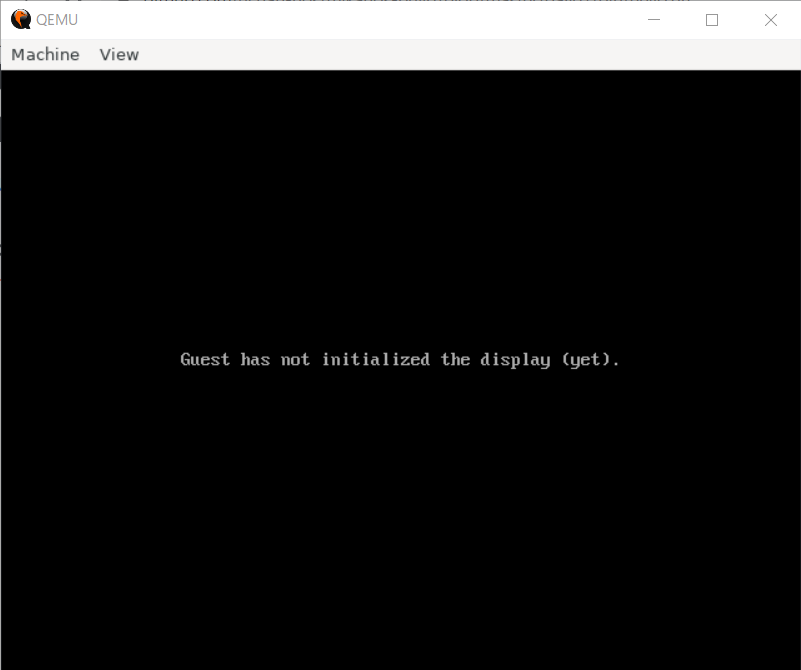

# OS自作もくもく ログ

## 作業ログ

### 5月17日

WSL上で作業。

```sh
sudo apt install okteta
```

`BOOTX64.EFI`を作成。

```sh
sudo apt install qemu qemu-system qemu-utils
```

QEMUの操作。

```sh
$ qemu-img create -f raw disk.img 200M
Formatting 'disk.img', fmt=raw size=209715200

$ mkfs.fat -n 'MIKAN OS' -s 2 -f 2 -R 32 -F 32 disk.img         
mkfs.fat 4.1 (2017-01-24)

$ mkdir -p mnt
$ sudo mount -o loop disk.img mnt
$ sudo mkdir -p mnt/EFI/BOOT
$ sudo cp BOOTX64.EFI mnt/EFI/BOOT/BOOTX64.EFI
$ sudo umount mnt
```

```sh
qemu-system-x86_64 -drive if=pflash,file=$HOME/github/osbook/devenv/OVMF_CODE.fd -drive if=pflash,file=$HOME/github/osbook/devenv/OVMF_VARS.fd -hda disk.img
```



Hello Worldが出なかった。