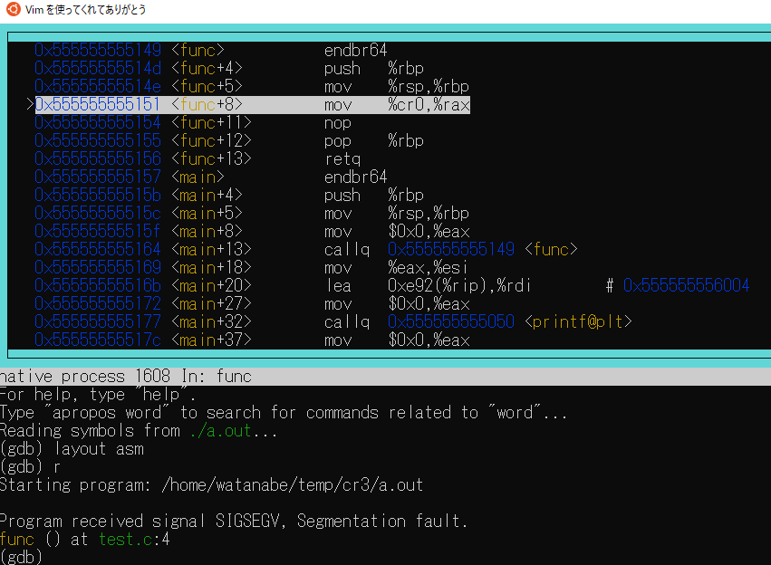
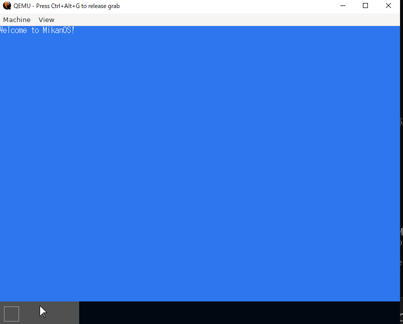
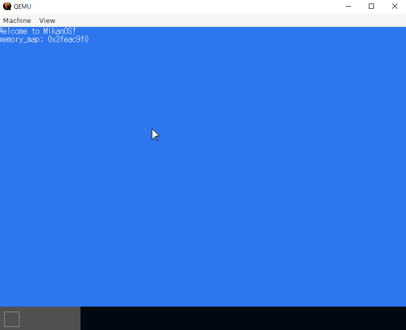
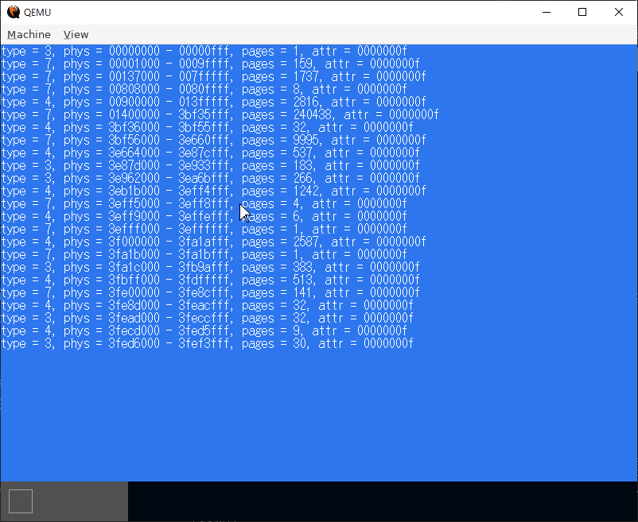
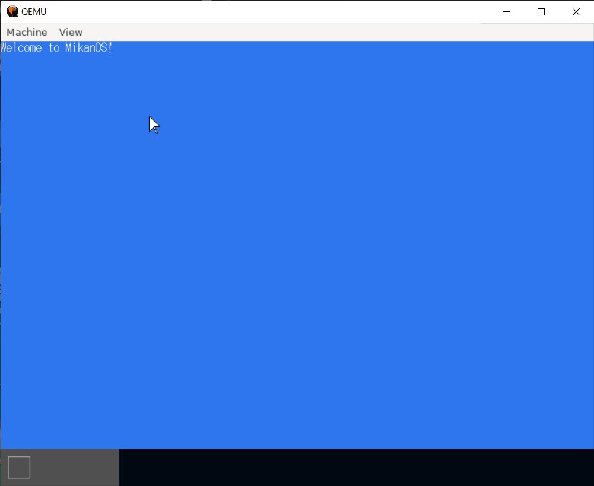
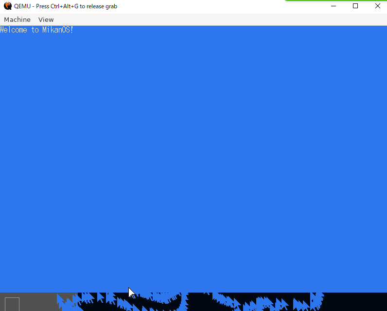
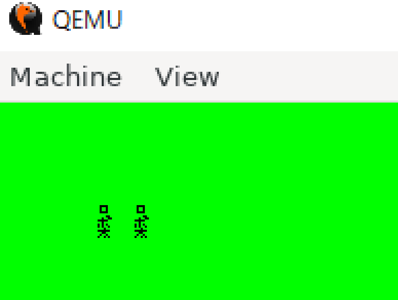

# 作業ログ

## 9月13日

ページテーブルの情報をCR3レジスタに書き込んでいる(p. 197)。確かCR3は特権プロセスでないと読み書きできなかった気がする。CR3については[ここ](https://babyron64.hatenablog.com/entry/2017/12/22/232423)が詳しかった。

ちょっと`cr0`の値を読んでみようとしたが、やはりダメですね。



operator new → malloc → sbrkの順番で呼ばれていることをgdbで確認。

```cpp
#include <cstdio>

int main(){
        int *a = new int[100];
}
```

```sh
$ g++ -g test.cpp
$ gdb ./a.out
(gdb) b sbrk
(gdb) r
Breakpoint 1, __GI___sbrk (increment=135168) at sbrk.c:32
32      sbrk.c: そのようなファイルやディレクトリはありません.
(gdb) bt
(gdb) bt
#0  __GI___sbrk (increment=135168) at sbrk.c:32
#1  0x00007ffff7c7cd0d in __GI___default_morecore (increment=<optimized out>) at morecore.c:47
#2  0x00007ffff7c776f5 in sysmalloc (nb=nb@entry=656, av=av@entry=0x7ffff7dc8b80 <main_arena>) at malloc.c:2470
#3  0x00007ffff7c78913 in _int_malloc (av=av@entry=0x7ffff7dc8b80 <main_arena>, bytes=bytes@entry=640) at malloc.c:4141
#4  0x00007ffff7c78afb in tcache_init () at malloc.c:2982
#5  0x00007ffff7c79d8e in tcache_init () at malloc.c:3044
#6  __GI___libc_malloc (bytes=72704) at malloc.c:3044
#7  malloc_hook_ini (sz=72704, caller=<optimized out>) at hooks.c:32
#8  0x00007ffff7e75c1a in ?? () from /lib/x86_64-linux-gnu/libstdc++.so.6
#9  0x00007ffff7fe0b8a in ?? () from /lib64/ld-linux-x86-64.so.2
#10 0x00007ffff7fe0c91 in ?? () from /lib64/ld-linux-x86-64.so.2
#11 0x00007ffff7fd013a in ?? () from /lib64/ld-linux-x86-64.so.2
#12 0x0000000000000001 in ?? ()
#13 0x00007fffffffeab2 in ?? ()
#14 0x0000000000000000 in ?? ()
```

`operator new`から呼ばれてるのがよくわからないな。調べてみたら、`operator new`よりも先に`sbrk`が呼ばれている。

```sh
$ strace ./a.out |& grep brk
brk(NULL)                               = 0x558fe4c89000
brk(NULL)                               = 0x558fe4c89000
brk(0x558fe4caa000)                     = 0x558fe4caa000
```

システムコールは`brk`で、`sbrk`は`brk`を呼んでいるだけっぽい。

```txt
 mov    $0xc,%eax
 syscall
```

これかな？



マウスの重ね合わせ処理はできた。system callとの関係はわからず。

## 9月6日

8章を進める。

まずは`osbook_day08a`をビルド。



まずは画面が出た。しかし、タイプが一つも現れない。edk2でビルドしなおす。



出た出た。

検索してたら、[一人AdCでOS自作している人](https://ja.tech.jar.jp/ac/2018/day00.html)を見つけた。「x86 ring protection」みたいな「そういう単語」で検索すると、「そういう人」が見つかる(そういう人しか見つからない)。

2章の理解が不十分なので、8章が理解できない。

KernelMainをどこから呼び出しているか忘れたので調べた。ブートローダの`Main.c`の356行目

```cpp
  entry_point(&config, &memmap);
```

だな。`kernel.elf`を読み込んで、アドレスを計算し、そのエントリポイントを取得し、関数として呼び出している。引数はコンフィグ情報とメモリマップ。これを

```cpp
extern "C" void KernelMain(const FrameBufferConfig& frame_buffer_config,
                           const MemoryMap& memory_map) {
```

で受け取る、と。

`config`は`FrameBufferConfig`で、

```cpp
  struct FrameBufferConfig config = {
    (UINT8*)gop->Mode->FrameBufferBase,
    gop->Mode->Info->PixelsPerScanLine,
    gop->Mode->Info->HorizontalResolution,
    gop->Mode->Info->VerticalResolution,
    0
  };
```

で中身を作っている。GOPとはGraphics Output Protocol。`memmap`は`gBS->GetMemoryMap`で受け取っている。`gBS`はUFEIのブートサービス。

理解が曖昧なまま進んだので厳しい。

## 8月30日

7章の中身の理解はとりあえずあきらめて動作確認する。

```sh
source ~/github/osbook/devenv/buildenv.sh
cd ~/workspace/mikanos/kernel
git switch -c osbook_day07a osbook_day07a
make
~/osbook/devenv/run_qemu.sh  ~/edk2/Build/MikanLoaderX64/DEBUG_CLANG38/X64/Loader.efi ~/workspace/mikanos/kernel/kernel.elf
```

マウスが動いたことは確認。

割り込み制御の`cli`や`sti`が特権命令であることを確認(普通に実行するとSIGSEGV)。`hlt`も特権命令。

`osbook_day07a`と`osbook_day07b`の違いを見るのに、git diffだと見づらかったのでVSCodeから見ようとGitLensを導入。なんかGitHubへのサインインを要求されて困ったが、とりあえずサインインせずに使えるようにした。

とりあえず7章を終わったことにして、次は8章。

## 8月23日

6章は(あまり理解できていないがとりあえず)わかったことにして7章へ。`volatile`属性について、ぼんやりとしか理解していなかったのを「揮発性」というキーワードで理解できた気がする。あと`reinterpret_cast`でメモリに直で書き込めるのか。UbuntuやMacだとランダマイズがあるので、CentOSで。

```cpp
#include <cstdio>

int a = 1;

int main(void) {
  printf("%p\n",&a);
  int* b = reinterpret_cast<int*>(0x601034);
  *b = 2;
  printf("%d\n",a);
}
```

```sh
$ g++ test.cpp
$ ./a.out
0x601034
2
```

マジか。言われてみればそうだけど。

ちなみに通常のコードではEnd of Interruptレジスタには書き込めないっぽい。

```cpp
#include <cstdio>
#include <cstdint>

int main(){
  volatile auto eoi = reinterpret_cast<uint32_t*>(0xfee0000b0);
  *eoi = 0;
}
```

上記コードはSIGSEGVで死ぬ。

ビットフィールドを初期化と勘違いした。

```cpp
struct hoge {
  int a : 5;
};
```

これ、MacのApple clang++でコンパイルするとhoge.aが偶然5になる。

ビットフィールドの指定の例。

```cpp
#include <cstdio>

struct hoge{
    int a; // 4バイト
    int b; // 4バイト
} __attribute__((packed)); //合わせて8バイト

struct hoge2{
    int a : 4; // 4ビット
    int b : 4; // 4ビット
} __attribute__((packed)); // 合わせて8ビット(1バイト)


int main(){
    printf("%ld\n",sizeof(hoge));  // => 8
    printf("%ld\n",sizeof(hoge2)); // => 1
}
```

なるほどね。

なんか、OS自作というより、知らなかったC/C++の言語仕様を知る会になっている。

## 8月16日

マウスカーソルをマウスにしてみた。


イベントループはmain関数内の`while(1)`であり、そこから`mikanos/kernel/usb/xhci/xchi.cpp`の`ProcessEvent`関数を呼んでいるらしいが、ここでの処理がどうなっているか追いきれなかった。MouseObserverの実装からして、現時点ではクリックイベントを取ることが考慮されていない？

## 7月26日

5.5 コンソールクラス。osbook_day05eをチェックアウトしてコンパイル、ビルドするだけ。一応`main.cpp`で

```cpp
for (int i = 0; i < 50; ++i) {
```

と行数を増やしてみて、表示がずれることを確認。これでいっか。

5.6 コンソールクラス。osbook_day05fをチェックアウトしてコンパイル、ビルドするだけ。`printk()`関数が実装された。一応

```cpp
  for (int i = 0; i < 20; ++i) {
    printk("printk: %02d\n", i);
  }
```

みたいにして、表示が0埋めされることも確認。5章終了。

6章に行こうとしたらシステムがすごく不安定に。WSL2のせいか？

とりあえずマウス描画できた。



マウス動いた。



## 7月19日

「4.5 ローダを改良する」をやった。完全に理解できたわけではないが、とりあえず棚上げ。

PHDRってなんの略かずっと調べてわからなかったんだけど、単に「Program HeaDeR」のことか・・・

せっかくビットマップフォントだったので、自前フォント作ってみた。



## 7月12日

今日は4.5まで。

```sh
~/osbook/devenv/run_qemu.sh  ~/edk2/Build/MikanLoaderX64/DEBUG_CLANG38/X64/Loader.efi ~/workspace/mikanos/kernel/kernel.elf
```

配置new、聞いたことはあっても使ったのは始めて。後は、

```cpp
pixel_writer = new(pixel_writer_buf)
        BGRResv8BitPerColorPixelWriter{frame_buffer_config};
```

という文法を初めてみた。C++11から導入された、[一様初期化](https://cpprefjp.github.io/lang/cpp11/uniform_initialization.html)というらしい。

例えば引数の無いクラス`Hoge`があったとして、

```sh
Hoge h;
```

とすると`Hoge`のインスタンスを作るが、

```sh
Hoge h();
```

とすると、`Hoge`のインスタンスを返す関数の宣言とみなされる。

## 7月5日

osbook_day03cまで。自力でピクセルを表示してしまったが、後でちゃんとやるようだ。

`MikanLoaderPkg/Main.c`を以下のように修正して、`FrameBufferBase`や`FrameBufferSize`を表示した。

```diff
-  Print(L"Kernel: 0x%0lx (%lu bytes)\n", kernel_base_addr, kernel_file_size);
+  //Print(L"Kernel: 0x%0lx (%lu bytes)\n", kernel_base_addr, kernel_file_size);
+  Print(L"FrameBufferBase: 0x%0lx Size:%d\n", gop->Mode->FrameBufferBase, gop->Mode->FrameBufferSize);
```


## 6月28日

Chapter 3.3まで。WSLの時計がまた狂っており、EDK IIのビルドに失敗していた。`run_qemu.sh`を使わず、自分でイメージを作って実行してみた。

## 6月21日

EFIのブートイメージ、BOOTX64.EFIという名前にしないといけないの、`osbook/devenv/run_qemu.sh`の中でちゃんとやってた。具体的には`mikanos-build/devenv/make_image.sh`の中のここだ。

```sh
sudo cp $EFI_FILE $MOUNT_POINT/EFI/BOOT/BOOTX64.EFI
```

P.44 で、`hello.efi`から直接イメージを作って実行しているが、その際に名前を変えていたのか。拡張子がefiのものがEFI/BOOTに入ってたら、それで良いと思ってた。

QEMUのターミナルモードを初めて使ったが、これはgdbとほぼ同じですね。

## 6月14日

EDK IIの作業。

mikanosのリポジトリのclone先は、書籍では`$HOME/workspace`が仮定されているが、`mikanos-build`では指定されていない？

mikanosでosbook_day02aがcheckoutできない。普通にやるとdetached headになってしまう。

```sh
Note: switching to 'osbook_day02a'.

You are in 'detached HEAD' state. You can look around, make experimental
changes and commit them, and you can discard any commits you make in this
state without impacting any branches by switching back to a branch.

If you want to create a new branch to retain commits you create, you may
do so (now or later) by using -c with the switch command. Example:

  git switch -c <new-branch-name>

Or undo this operation with:

  git switch -

Turn off this advice by setting config variable advice.detachedHead to false

HEAD is now at 5829bef change code style
```

ちゃんとタグを指定してcheckoutする。

```sh
git checkout -b osbook_day02a refs/tags/osbook_day02a
```

これが必要。EDK IIが動かない。`~/edk`を削除してもう一度ansibleやってみる。ダメ。こうなる。

```sh
$ source ./edksetup.sh
Usage: edksetup.sh [Options]

The system environment variable, WORKSPACE, is always set to the current
working directory.

Options:
  --help, -h, -?        Print this help screen and exit.

  --reconfig            Overwrite the WORKSPACE/Conf/*.txt files with the
                        template files from the BaseTools/Conf directory.

Please note: This script must be 'sourced' so the environment can be changed.
. edksetup.sh
source edksetup.sh
```

もしかして・・・とbashに変えて実行してみた。

```sh
$ source ./edksetup.sh
Loading previous configuration from /home/watanabe/edk2/Conf/BuildEnv.sh
Using EDK2 in-source Basetools
WORKSPACE: /home/watanabe/edk2
EDK_TOOLS_PATH: /home/watanabe/edk2/BaseTools
CONF_PATH: /home/watanabe/edk2/Conf
```

動くじゃないか！ zshのせいだったのか！！

```sh
build
```

ビルドできた・・・。

## 6月7日

[ここ](https://qiita.com/yamoridon/items/4905765cc6e4f320c9b5)を参考に、MacでC言語からHello Worldに挑戦。

```sh
$ brew install llvm

Error: llvm 11.1.0 is already installed.
To upgrade to 12.0.0, run:
```

11.1.0が入っていたが、12.0.0にアップグレード。

```sh
brew upgrade llvm
```

llvmは`/usr/local/opt/llvm/bin`にインストールされるが、ここには自動でパスは通らないようだ。

```sh
export PATH=/usr/local/opt/llvm/bin:$PATH
```

```sh
$ which clang++
/usr/local/opt/llvm/bin/clang++
```

うん、パスが通った。

これでhello.efiが作れるようになったが、これをそのまま`/Volumes/MIKAN\ OS/EFI/BOOT/`に突っ込んでもダメで、`BOOTX64.EFI`という名前にしないとダメだった。でもこれでMacでもC言語からBootできた。

Macでのqemuのバージョン。

```sh
$ qemu-system-x86_64 --version
QEMU emulator version 5.2.0
Copyright (c) 2003-2020 Fabrice Bellard and the QEMU Project developers
```

WSLでのバージョンは4.2.1。hello.efiのままで良いか、それともBOOTX64.EFIにしないといけないのかは、このバージョン差異のせいか？

## 5月31日

WSL2上でもう一度ansibleに挑戦。

```sh
$ ansible-playbook -K -i ansible_inventory ansible_provision.yml
(snip)
TASK [clone EDK II repository] ***************************************************************
changed: [localhost]

TASK [build EDK II base tools] ***************************************************************
changed: [localhost]

TASK [download standard libraries] ***********************************************************
fatal: [localhost]: FAILED! => {"changed": false, "msg": "dest '/home/watanabe/osbook/devenv' must be an existing dir"}

PLAY RECAP ***********************************************************************************
localhost                  : ok=7    changed=5    unreachable=0    failed=1    skipped=0    rescued=0    ignored=0
```

EDK IIのインストールまでは行ったが、「TASK [download standard libraries] 」で失敗している。なぜだ？

どうやら、osbookが`$HOME`直下にないとダメだった模様。再度挑戦。

```sh
$ ansible-playbook -K -i ansible_inventory ansible_provision.yml
(snip)
TASK [configure display variable if WSL2] ****************************************************
changed: [localhost]

PLAY RECAP ***********************************************************************************
localhost                  : ok=9    changed=4    unreachable=0    failed=0    skipped=1    rescued=0    ignored=0
```

最後まで通った。

```sh
$ iasl -v

Intel ACPI Component Architecture
ASL+ Optimizing Compiler/Disassembler version 20190509
Copyright (c) 2000 - 2019 Intel Corporation
```

iaslも入った。

Macでもansibleを入れてみる。

```sh
brew install ansible
```

ansibleは入るが、コマンドがUbuntuを前提にしているため、そのまま実行できない。ansibleの中身を見て実行する必要あり。

MikanOSのソースコードを入手。

```sh
cd github
git clone https://github.com/uchan-nos/mikanos.git
cd ~/edk2
ln -s ~/github/mikanos/MikanLoaderPkg ./
```

edksetup.shを実行。

```sh
$ source edksetup.sh
Usage: edksetup.sh [Options]

The system environment variable, WORKSPACE, is always set to the current
working directory.

Options:
  --help, -h, -?        Print this help screen and exit.

  --reconfig            Overwrite the WORKSPACE/Conf/*.txt files with the
                        template files from the BaseTools/Conf directory.

Please note: This script must be 'sourced' so the environment can be changed.
. edksetup.sh
source edksetup.sh
```

実行できない。

C言語からのEFI実行。


できたぞ。`chap01_c`で

```sh


## 5月18日

学校のマシン。

```sh
$ qemu-system-x86_64 --version
QEMU emulator version 4.2.0 (Debian 1:4.2-3ubuntu6)
Copyright (c) 2003-2019 Fabrice Bellard and the QEMU Project developers
```

ちょっと古い？

```sh
sudo hwclock -s # 時間がずれてたので
sudo apt update
sudo apt upgrade
```

```sh
qemu-system-x86_64 --version
QEMU emulator version 4.2.1 (Debian 1:4.2-3ubuntu6.16)
Copyright (c) 2003-2019 Fabrice Bellard and the QEMU Project developers
```

バージョンが上がった。

これで試したら学校のマシンでもできた！

Macでは、mkfs.fatがない。

```sh
brew install dosfstools
```

### 5月17日

WSL上で作業。

```sh
sudo apt install okteta
```

`BOOTX64.EFI`を作成。

```sh
sudo apt install qemu qemu-system qemu-utils
```

QEMUの操作。

```sh
$ qemu-img create -f raw disk.img 200M
Formatting 'disk.img', fmt=raw size=209715200

$ mkfs.fat -n 'MIKAN OS' -s 2 -f 2 -R 32 -F 32 disk.img         
mkfs.fat 4.1 (2017-01-24)

$ mkdir -p mnt
$ sudo mount -o loop disk.img mnt
$ sudo mkdir -p mnt/EFI/BOOT
$ sudo cp BOOTX64.EFI mnt/EFI/BOOT/BOOTX64.EFI
$ sudo umount mnt
```

```sh
qemu-system-x86_64 -drive if=pflash,file=$HOME/github/osbook/devenv/OVMF_CODE.fd -drive if=pflash,file=$HOME/github/osbook/devenv/OVMF_VARS.fd -hda disk.img
```


Hello Worldが出なかった。

家で上記をそのまま実行したらHello, World!が出た。


qemuのバージョンは4.2.1。

```sh
$ qemu-system-x86_64 --version
QEMU emulator version 4.2.1 (Debian 1:4.2-3ubuntu6.16)
Copyright (c) 2003-2019 Fabrice Bellard and the QEMU Project developers
```

Ubuntuのバージョンは

```sh
$ cat /etc/os-release |grep VERSION
VERSION="20.04.2 LTS (Focal Fossa)"
VERSION_ID="20.04"
VERSION_CODENAME=focal
```

後で学校のマシンとの違いを調べること。