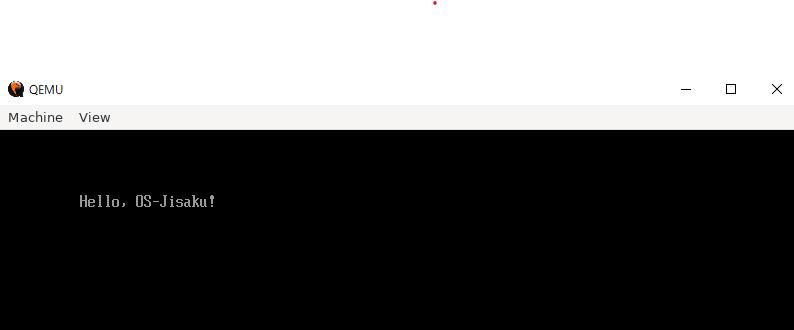
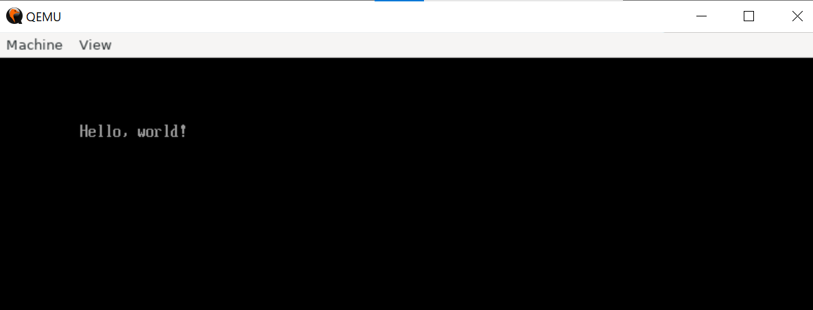

# 作業ログ

## 6月7日

[ここ](https://qiita.com/yamoridon/items/4905765cc6e4f320c9b5)を参考に、MacでC言語からHello Worldに挑戦。

```sh
$ brew install llvm

Error: llvm 11.1.0 is already installed.
To upgrade to 12.0.0, run:
```

11.1.0が入っていたが、12.0.0にアップグレード。

```sh
brew upgrade llvm
```

llvmは`/usr/local/opt/llvm/bin`にインストールされるが、ここには自動でパスは通らないようだ。

```sh
export PATH=/usr/local/opt/llvm/bin:$PATH
```

```sh
$ which clang++
/usr/local/opt/llvm/bin/clang++
```

うん、パスが通った。

これでhello.efiが作れるようになったが、これをそのまま`/Volumes/MIKAN\ OS/EFI/BOOT/`に突っ込んでもダメで、`BOOTX64.EFI`という名前にしないとダメだった。でもこれでMacでもC言語からBootできた。

Macでのqemuのバージョン。

```sh
$ qemu-system-x86_64 --version
QEMU emulator version 5.2.0
Copyright (c) 2003-2020 Fabrice Bellard and the QEMU Project developers
```

WSLでのバージョンは4.2.1。hello.efiのままで良いか、それともBOOTX64.EFIにしないといけないのかは、このバージョン差異のせいか？

## 5月31日

WSL2上でもう一度ansibleに挑戦。

```sh
$ ansible-playbook -K -i ansible_inventory ansible_provision.yml
(snip)
TASK [clone EDK II repository] ***************************************************************
changed: [localhost]

TASK [build EDK II base tools] ***************************************************************
changed: [localhost]

TASK [download standard libraries] ***********************************************************
fatal: [localhost]: FAILED! => {"changed": false, "msg": "dest '/home/watanabe/osbook/devenv' must be an existing dir"}

PLAY RECAP ***********************************************************************************
localhost                  : ok=7    changed=5    unreachable=0    failed=1    skipped=0    rescued=0    ignored=0
```

EDK IIのインストールまでは行ったが、「TASK [download standard libraries] 」で失敗している。なぜだ？

どうやら、osbookが`$HOME`直下にないとダメだった模様。再度挑戦。

```sh
$ ansible-playbook -K -i ansible_inventory ansible_provision.yml
(snip)
TASK [configure display variable if WSL2] ****************************************************
changed: [localhost]

PLAY RECAP ***********************************************************************************
localhost                  : ok=9    changed=4    unreachable=0    failed=0    skipped=1    rescued=0    ignored=0
```

最後まで通った。

```sh
$ iasl -v

Intel ACPI Component Architecture
ASL+ Optimizing Compiler/Disassembler version 20190509
Copyright (c) 2000 - 2019 Intel Corporation
```

iaslも入った。

Macでもansibleを入れてみる。

```sh
brew install ansible
```

ansibleは入るが、コマンドがUbuntuを前提にしているため、そのまま実行できない。ansibleの中身を見て実行する必要あり。

MikanOSのソースコードを入手。

```sh
cd github
git clone https://github.com/uchan-nos/mikanos.git
cd ~/edk2
ln -s ~/github/mikanos/MikanLoaderPkg ./
```

edksetup.shを実行。

```sh
$ source edksetup.sh
Usage: edksetup.sh [Options]

The system environment variable, WORKSPACE, is always set to the current
working directory.

Options:
  --help, -h, -?        Print this help screen and exit.

  --reconfig            Overwrite the WORKSPACE/Conf/*.txt files with the
                        template files from the BaseTools/Conf directory.

Please note: This script must be 'sourced' so the environment can be changed.
. edksetup.sh
source edksetup.sh
```

実行できない。

C言語からのEFI実行。



できたぞ。`chap01_c`で

```sh


## 5月18日

学校のマシン。

```sh
$ qemu-system-x86_64 --version
QEMU emulator version 4.2.0 (Debian 1:4.2-3ubuntu6)
Copyright (c) 2003-2019 Fabrice Bellard and the QEMU Project developers
```

ちょっと古い？

```sh
sudo hwclock -s # 時間がずれてたので
sudo apt update
sudo apt upgrade
```

```sh
qemu-system-x86_64 --version
QEMU emulator version 4.2.1 (Debian 1:4.2-3ubuntu6.16)
Copyright (c) 2003-2019 Fabrice Bellard and the QEMU Project developers
```

バージョンが上がった。

これで試したら学校のマシンでもできた！

Macでは、mkfs.fatがない。

```sh
brew install dosfstools
```

### 5月17日

WSL上で作業。

```sh
sudo apt install okteta
```

`BOOTX64.EFI`を作成。

```sh
sudo apt install qemu qemu-system qemu-utils
```

QEMUの操作。

```sh
$ qemu-img create -f raw disk.img 200M
Formatting 'disk.img', fmt=raw size=209715200

$ mkfs.fat -n 'MIKAN OS' -s 2 -f 2 -R 32 -F 32 disk.img         
mkfs.fat 4.1 (2017-01-24)

$ mkdir -p mnt
$ sudo mount -o loop disk.img mnt
$ sudo mkdir -p mnt/EFI/BOOT
$ sudo cp BOOTX64.EFI mnt/EFI/BOOT/BOOTX64.EFI
$ sudo umount mnt
```

```sh
qemu-system-x86_64 -drive if=pflash,file=$HOME/github/osbook/devenv/OVMF_CODE.fd -drive if=pflash,file=$HOME/github/osbook/devenv/OVMF_VARS.fd -hda disk.img
```


Hello Worldが出なかった。

家で上記をそのまま実行したらHello, World!が出た。



qemuのバージョンは4.2.1。

```sh
$ qemu-system-x86_64 --version
QEMU emulator version 4.2.1 (Debian 1:4.2-3ubuntu6.16)
Copyright (c) 2003-2019 Fabrice Bellard and the QEMU Project developers
```

Ubuntuのバージョンは

```sh
$ cat /etc/os-release |grep VERSION
VERSION="20.04.2 LTS (Focal Fossa)"
VERSION_ID="20.04"
VERSION_CODENAME=focal
```

後で学校のマシンとの違いを調べること。