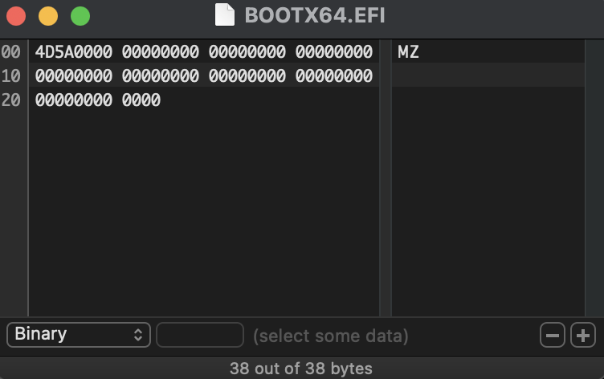
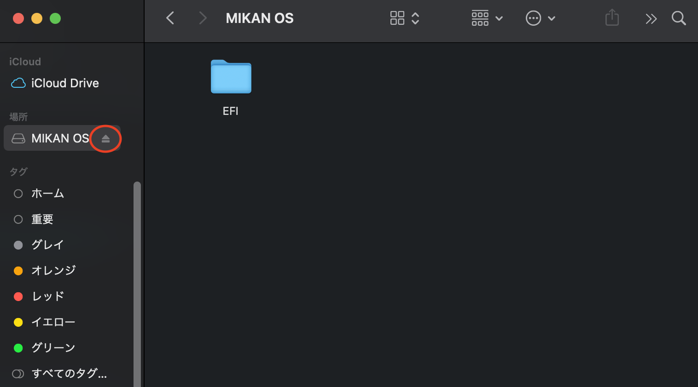
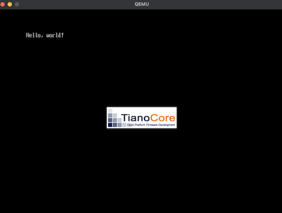

# Macでの環境構築

## Hello World

対応ディレクトリは`chap01_hello`。

### バイナリエディタ

Macのバイナリエディタはとりあえず[Hex Fiend](https://hexfiend.com/)が良いと思われる。ViewsのLine Number FormatをHexadecimalにして、幅も調整すると本との対応をつけやすい。



### リポジトリのクローン

```sh
mkdir github
cd github
git clone https://github.com/uchan-nos/mikanos-build.git osbook
git clone https://github.com/kaityo256/osmokumoku.git
```

以下、`chap01_mac`で作業。

```sh
cd osmokumoku
cd chap01_mac
```

### qemuとdosfstoolsのインストール

```sh
brew install qemu dosfstools
```

### ディスクイメージの作成

```sh
qemu-img create -f raw disk.img 200M
/usr/local/Cellar/dosfstools/4.2/sbin/mkfs.fat -n 'MIKAN OS' -s 2 -f 2 -R 32 -F 32 disk.img       
```

### ディスクへの書き込み

```sh
open disk.img
```

Finderで「MIKAN OS」がマウントされたのを確認してから、

```sh
mkdir -p /Volumes/MIKAN\ OS/EFI/BOOT
cp BOOTX64.EFI /Volumes/MIKAN\ OS/EFI/BOOT
```

その後、Finderの「MIKAN OS」の右側にあるイジェクトボタン(unmount)を押す。



コマンドラインからのunmountではなぜか正しく書き込みがなされないので注意。

### QEMUの起動

```sh
qemu-system-x86_64 -drive if=pflash,file=$HOME/github/osbook/devenv/OVMF_CODE.fd -drive if=pflash,file=$HOME/github/osbook/devenv/OVMF_VARS.fd -hda disk.img
```

QEMUが起動し、Hello, world!が表示されるはず。



### シェルスクリプト

以上の作業をまとめて、`chap01_hello`にて、

```sh
source mkimg.sh
```

手作業でのunmount。

```sh
source run.sh
```

で行ける。

## C言語でHello World

対応ディレクトリは`chap01_c`

### LLVMのインストール

brewでLLVMをインストールする。

```sh
brew install llvm
```

もし古いLLVMが入っていた場合は

```sh
brew upgrade llvm
```

でアップグレードする。llvmは`/usr/local/opt/llvm/bin`にインストールされるので、

```sh
export PATH=/usr/local/opt/llvm/bin:$PATH
```

でパスを通す。これで`clang++`や`lld-link`が使えるようになる。

`hello.efi`を作る。

```sh
clang -target x86_64-pc-win32-coff -o hello.o -c hello.c
lld-link /subsystem:efi_application /entry:EfiMain /out:hello.efi hello.o
```

次にディスクイメージを作る。

```sh
qemu-img create -f raw disk.img 200M
/usr/local/Cellar/dosfstools/4.2/sbin/mkfs.fat -n 'MIKAN OS' -s 2 -f 2 -R 32 -F 32 disk.img         
```

ディスクイメージをマウントする。

```sh
open disk.img
```

次に、`hello.efi`を`BOOTX64.EFI`という名前でマウントしたディスクイメージにコピーする。WSLでは`hello.efi`のままで良かったが、Macでは`BOOTX64.EFI`という名前にしないとダメ。

```sh
cp hello.efi /Volumes/MIKAN\ OS/EFI/BOOT/BOOTX64.EFI
```

