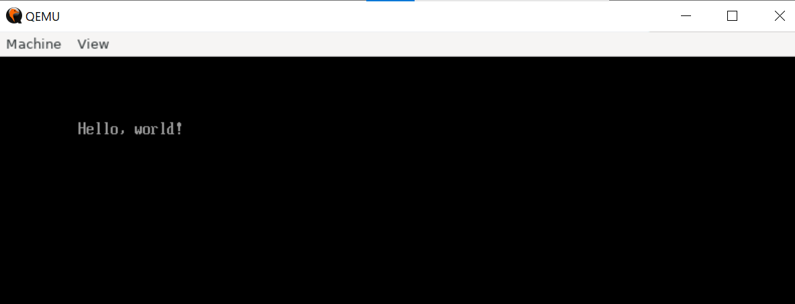
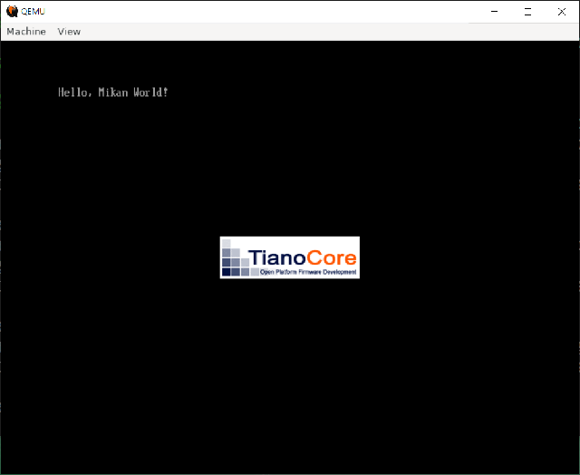
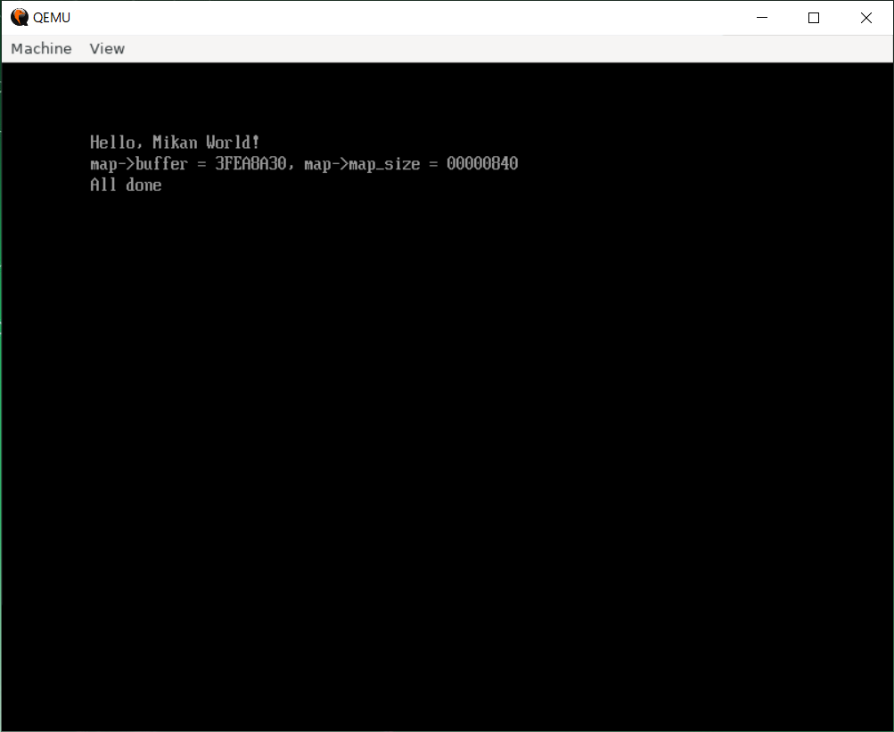
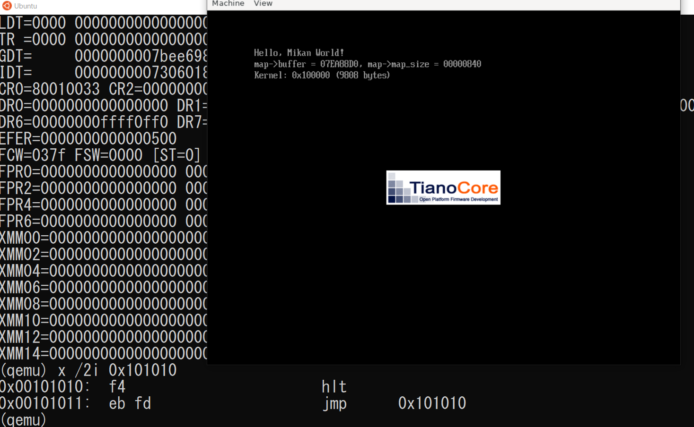
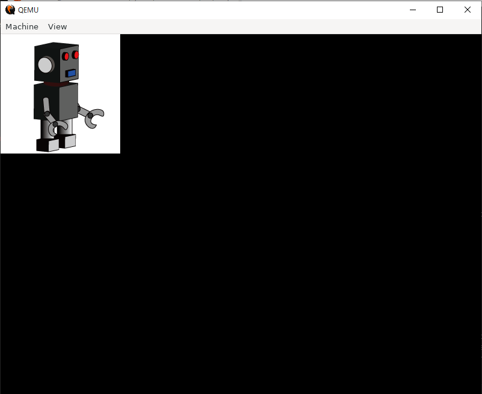

# Windows WSL2 (Ubuntu)での実行方法

## qemuのインストール

```sh
sudo hwclock -s # WSLは時間がずれることが多いので修正
sudo apt update
sudo apt upgrade
sudo apt install -y qemu qemu-system qemu-utils ansible
```

`qemu-system-x86_64`のバージョンが4.2.1ならOK。

```sh
$ qemu-system-x86_64 --version
QEMU emulator version 4.2.1 (Debian 1:4.2-3ubuntu6.16)
Copyright (c) 2003-2019 Fabrice Bellard and the QEMU Project developers
```

### リポジトリのクローンと実行

開発ツールの導入

```sh
$ git clone https://github.com/uchan-nos/mikanos-build.git osbook
$ cd osbook
$ ansible-playbook -K -i ansible_inventory ansible_provision.yml
/home/watanabe/.pyenv/libexec/pyenv: 44 行: cd: ansible: ディレクトリではありません
Traceback (most recent call last):
  File "/usr/bin/ansible-playbook", line 34, in <module>
    from ansible import context
ModuleNotFoundError: No module named 'ansible'
```

いま使っているPythonがansible moduleを読み込めていない。

```sh
$ ansible -m ping localhost
Traceback (most recent call last):
  File "/usr/bin/ansible", line 34, in <module>
    from ansible import context
ModuleNotFoundError: No module named 'ansible'
```

ダメですね。

```sh
$ /usr/bin/python3 /usr/bin/ansible -m ping localhost
localhost | SUCCESS => {
    "changed": false,
    "ping": "pong"
}
```

いけた。とりあえずインタプリタを直接叩く。

```sh
$ /usr/bin/python3  /usr/bin/ansible-playbook -K -i ansible_inventory ansible_provision.yml
```

これでOK。

```txt
TASK [configure display variable if WSL2] *********************************************************************
fatal: [localhost]: FAILED! => {"changed": false, "msg": "Destination /home/watanabe/.profile does not exist !", "rc": 257}
```

途中で上記のエラーでこけることがある。

```sh
touch ~/.profile
```

してからやり直したら走った。

```sh
cd ~/
mkdir -p github
cd github
git clone https://github.com/kaityo256/osmokumoku.git
```

以下、`osmokumoku`ディレクトリの`chap01_wsl`で作業。

```sh
cd osmokumoku
cd chap01_wsl
```

イメージの作成手順。

```sh
qemu-img create -f raw disk.img 200M
mkfs.fat -n 'MIKAN OS' -s 2 -f 2 -R 32 -F 32 disk.img
mkdir -p mnt
sudo mount -o loop disk.img mnt
sudo mkdir -p mnt/EFI/BOOT
sudo cp BOOTX64.EFI mnt/EFI/BOOT/BOOTX64.EFI
sudo umount mnt
```

QEMUで実行

```sh
qemu-system-x86_64 -drive if=pflash,file=$HOME/github/osbook/devenv/OVMF_CODE.fd -drive if=pflash,file=$HOME/github/osbook/devenv/OVMF_VARS.fd -hda disk.img
```

以上をまとめて以下のようにシェルスクリプトを実行しても良い。

```sh
source mkimg.sh
source run.sh
```

QEMUが起動し、Hello, world!が表示されるはず。



## EDK IIからの実行

`mikanos`のリポジトリをクローンする。

```sh
mkdir workspace
cd workspace
git clone https://github.com/uchan-nos/mikanos.git
cd mikanos
```

`osbook_day02a`タグをチェックアウトする。

```sh
git checkout -b osbook_day02a refs/tags/osbook_day02a
```

EDK IIでシンボリックリンクをはる。

```sh
cd ~/edk2
ln -s ~/workspace/mikanos/MikanLoaderPkg ./
```

ここで、`edksetup.sh`を実行するのだが、**zshでは動かない**。こうなってしまう。

```sh
$ source ./edksetup.sh
Usage: edksetup.sh [Options]

The system environment variable, WORKSPACE, is always set to the current
working directory.

Options:
  --help, -h, -?        Print this help screen and exit.

  --reconfig            Overwrite the WORKSPACE/Conf/*.txt files with the
                        template files from the BaseTools/Conf directory.

Please note: This script must be 'sourced' so the environment can be changed.
. edksetup.sh
source edksetup.sh
```

bashなら動く。

```sh
$ source ./edksetup.sh
Using EDK2 in-source Basetools
WORKSPACE: /home/watanabe/edk2
EDK_TOOLS_PATH: /home/watanabe/edk2/BaseTools
CONF_PATH: /home/watanabe/edk2/Conf
Copying $EDK_TOOLS_PATH/Conf/build_rule.template
     to /home/watanabe/edk2/Conf/build_rule.txt
Copying $EDK_TOOLS_PATH/Conf/tools_def.template
     to /home/watanabe/edk2/Conf/tools_def.txt
Copying $EDK_TOOLS_PATH/Conf/target.template
     to /home/watanabe/edk2/Conf/target.txt
```

`Conf/target.txt`を、本の通りに書き直した後で`build`する。

```sh
cd ~/edk2
build
```

`~/edk2/Build/MikanLoaderX64/DEBUG_CLANG38/X64`に、`Loader.efi`ができていれば成功。

これをイメージに読み込む。方法を`osmokumoku/wsl/chap02_edk`にまとめた。

`mkimg.sh`の内容。これまでとの違いはEFIファイルをedk2のところからコピーするところ。

```sh
qemu-img create -f raw disk.img 200M
mkfs.fat -n 'MIKAN OS' -s 2 -f 2 -R 32 -F 32 disk.img
mkdir -p mnt
sudo mount -o loop disk.img mnt
sudo mkdir -p mnt/EFI/BOOT
sudo cp ~/edk2/Build/MikanLoaderX64/DEBUG_CLANG38/X64/Loader.efi mnt/EFI/BOOT/BOOTX64.EFI
sudo umount mnt
```

`run.sh`は同じ。

```sh
qemu-system-x86_64 -drive if=pflash,file=$HOME/github/osbook/devenv/OVMF_CODE.fd -drive if=pflash,file=$HOME/github/osbook/devenv/OVMF_VARS.fd -hda disk.img
```

実行すると「Hello, Mikan World」が表示される。



## 2.7 メモリマップの確認

EDK2でhello worldまでできてればすぐできる。

```sh
cd ~/workspace/mikanos
git checkout -b osbook_day02b osbook_day02b
cd ~/edk2
source edksetup.sh
build
```

として、`Loader.efi`を作ってから、適当なところで`run_qemu.sh`を実行すればよい。このリポジトリでは `chap02_mmap`に移動して`run.sh`を実行すれば同じことができる。

```sh
cd ~/github/osmokumoku
cd wsl/chap02_mmap
source run.sh
```

ちなみに`run.sh`の中身は以下の通り。

```sh
~/osbook/devenv/run_qemu.sh ~/edk2/Build/MikanLoaderX64/DEBUG_CLANG38/X64/Loader.efi
```

以下のような画面が出れば成功。



同じディレクトリに`disk.img`ができているはずなので、それをマウントし、中身を確認する。

```sh
$ mkdir -p mnt
$ sudo mount -o loop disk.img mnt
$ ls mnt
EFI/  memmap*
$ cat mnt/memmap
0, 3, EfiBootServicesCode, 00000000, 1, F
1, 7, EfiConventionalMemory, 00001000, 9F, F
2, 7, EfiConventionalMemory, 00100000, 700, F
(snip)
41, 6, EfiRuntimeServicesData, 3FEF4000, 84, F
42, A, EfiACPIMemoryNVS, 3FF78000, 88, F
43, 6, EfiRuntimeServicesData, FFC00000, 400, 1
```

## 3章

### 3.3

```sh
cd ~/workspace/mikanos
git checkout -b osbook_day03a osbook_day03a
cd kernel
clang++ -O2 -Wall -g --target=x86_64-elf -ffreestanding -mno-red-zone -fno-exceptions -fno-rtti -std=c++17 -c main.cpp
ld.lld --entry KernelMain -z norelro --image-base 0x100000 --static -o kernel.elf main.o
```

これで`kernel.elf`ができる。できたか`readelf`で見てみる。

```sh
$ readelf -h kernel.elf
ELF ヘッダ:
  マジック:   7f 45 4c 46 02 01 01 00 00 00 00 00 00 00 00 00
  クラス:                            ELF64
  データ:                            2 の補数、リトルエンディアン
  Version:                           1 (current)
  OS/ABI:                            UNIX - System V
  ABI バージョン:                    0
  型:                                EXEC (実行可能ファイル)
  マシン:                            Advanced Micro Devices X86-64
  バージョン:                        0x1
  エントリポイントアドレス:               0x101000
  プログラムヘッダ始点:          64 (バイト)
  セクションヘッダ始点:          8904 (バイト)
  フラグ:                            0x0
  Size of this header:               64 (bytes)
  Size of program headers:           56 (bytes)
  Number of program headers:         4
  Size of section headers:           64 (bytes)
  Number of section headers:         14
  Section header string table index: 12
  ```

重要なのはエントリポイントアドレス。`0x101000`になっている。

EDK IIへ行く。

```sh
cd ~/edk2
bash # 僕はzshなのでbashに切り替えなければならない
source edksetup.sh
build
```

その後、

```sh
~/osbook/devenv/run_qemu.sh ~/edk2/Build/MikanLoaderX64/DEBUG_CLANG38/X64/Loader.efi ./kernel.elf
```

で実行できる。

以上を、`run_qemu.sh`を使わない実行方法として、`osmokumoku/wsl/chap03_3`に以下を用意した。

```sh
make
./mkimg.sh
./run.sh
```

これでQEMUが実行される。事前にEDK IIでビルドを済ませておかなければならない。実行すると`Hello, Mikan World!`と表示され、QEMUのモニタモードになるので、RIPの値を調べ、その付近のアドレスを表示してみて`hlt`などがあればできている。



### 3.5

カーネルからのピクセルの処理。事前にosbookのcheckoutと、edk2のビルドをしておく。

```sh
cd ~/workspace/mikanos
git checkout -b osbook_day03a osbook_day03a
cd ~/edk2
source ./edksetup.sh
build
```

ブートローダができたら、カーネルを作る。`osmokumoku/ws/chap03_3c`にあるのは、適当なPNGファイルを読み込んで実行するカーネルのサンプル。

PNGファイルをPythonで読み込み、インクルードファイルを作っている。

```sh
python3 fig.py > robo.h
```

あとはmakeすれば`kernel.elf`ができる。

```sh
make
```

edk2でビルドしておく必要がある。

```sh
./run_qemu.sh
```

で、以下の画面がでてきたら成功。

